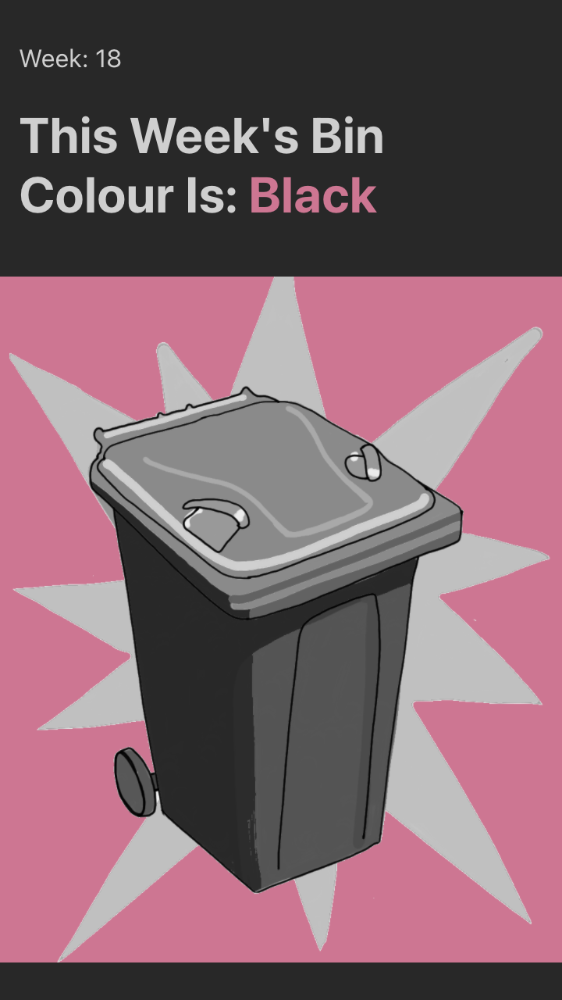
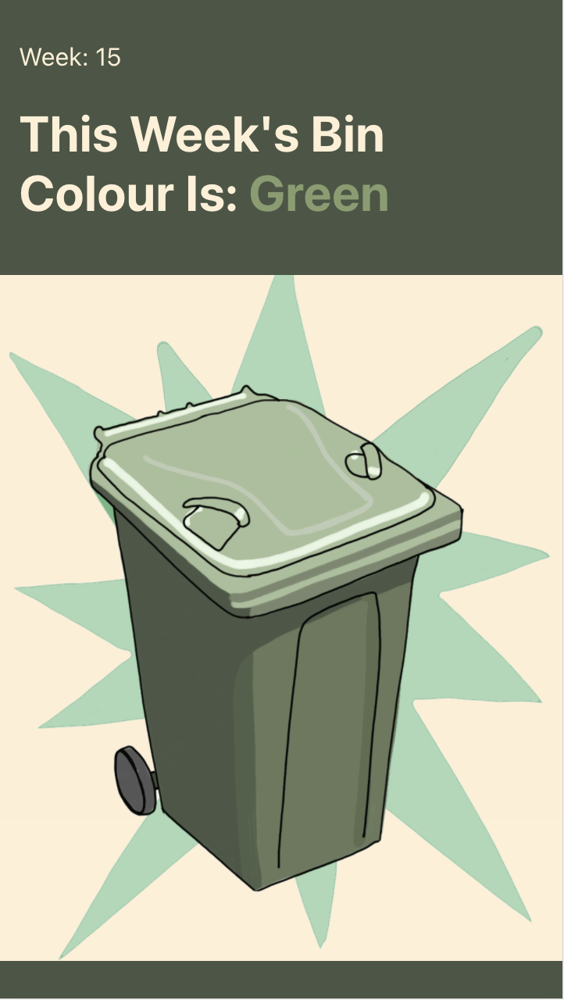

# Bin Day

This application is designed for a very simple application:

What Bin is it this week?

The application shows the user the week of the year they are in and the colour of the bin to put out.

## Contents

1. [Purpose](#purpose)
2. [Technologies and Dependencies](#technologies-and-dependencies)
3. [Development](#development)
4. [Updates](#updates)
5. [License](#license)

## Purpose

The purpose of this project was to test out TypeScript, having never used it before this was a great simple application to start on.

## Technologies and Dependencies

For this project I have used:

- TypeScript
- HTML
- Javascript
- Styled Components
- CSS
- React

Project Dependencies are:

- React
- GH-Pages
- Styled-Components
- TypeScript

## Development

To further develop this application I can introduce:

- Ability to choose a bin day
- Program in multiple bin days and the associated colour
- Have user log in for more access to the application.
- Add Notifications for your bin day.

## Updates

There are no Updates at this time

## License

All graphics are copyright to Samantha Wakelam and may not be used without express permission.

Open source Code is
Licensed under the MIT License.

A short and simple permissive license with conditions only requiring preservation of copyright and license notices. Licensed works, modifications, and larger works may be distributed under different terms and without source code.
